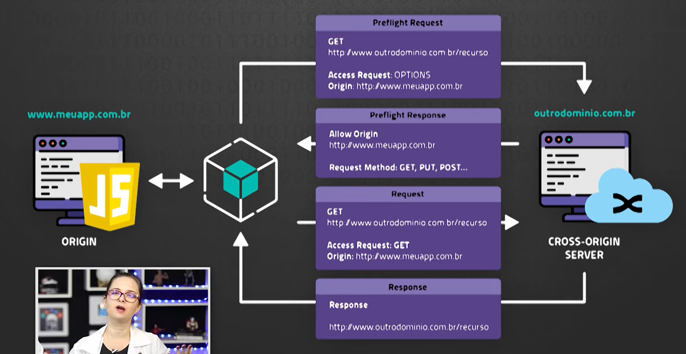

# CORS
* Cross- Origin Resource Sharing

#
* O CORS precisa existir para que haja segurança na navegação.
* Sem CORS, navegar poderia ser algo extremamente perigoso

# Diagrama

* Origin (wwww.meuapp.com.br) -> Prefilight Request -> outrodominio.com.br (Cross-Origin Server)

Prefilight Request = GET | Access Request:OPTIONS

Prefilight Response = GET | Acess Request; GET

